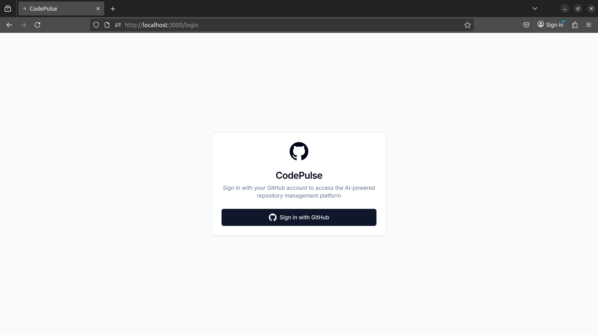
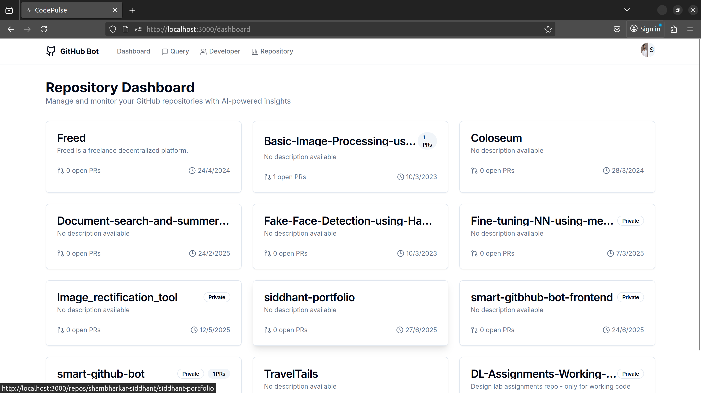
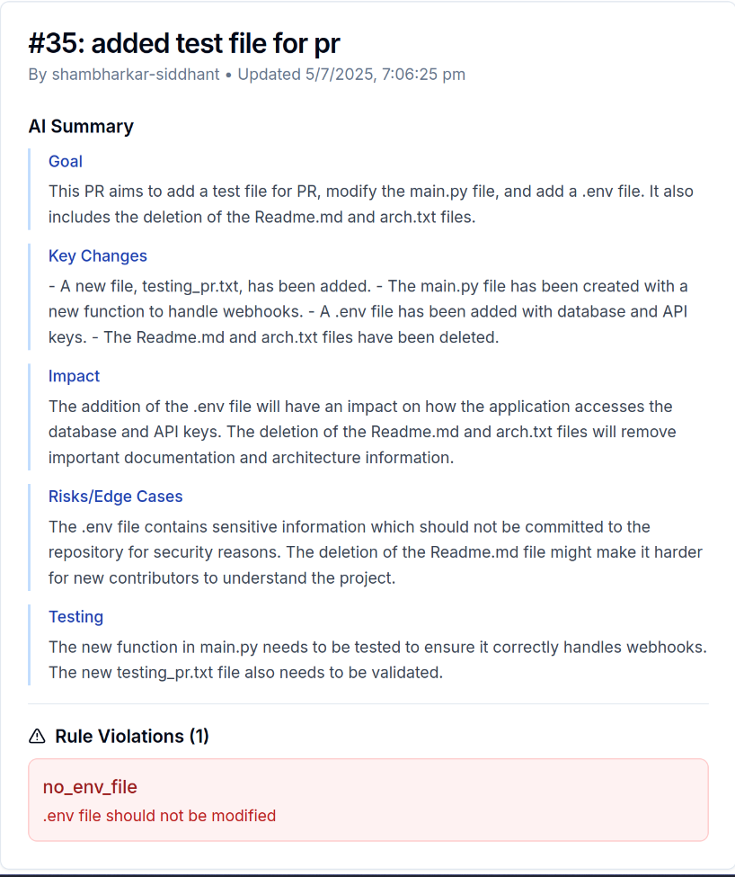
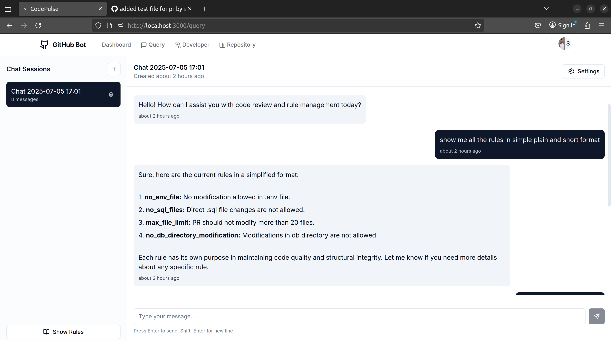
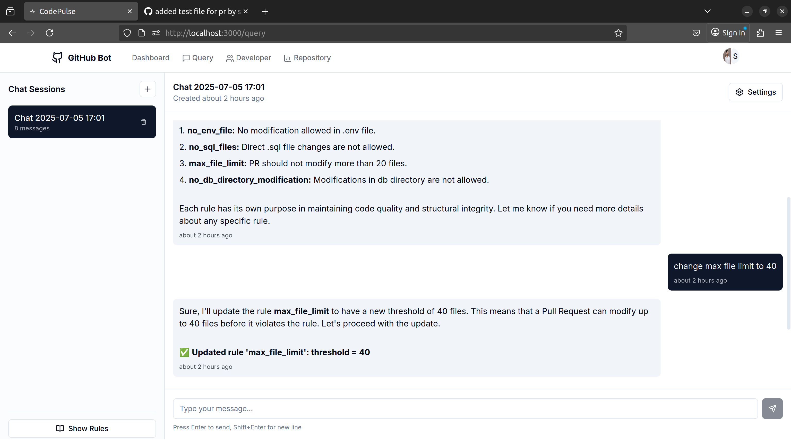

# Smart GitHub Bot: Model Context Protocol (MCP) Server

A modern, AI-powered assistant for code review, pull request analysis, and team collaboration on GitHub, built around the Model Context Protocol (MCP) server.

This project provides a backend MCP server and frontend interface for chat-based code review, rule enforcement, and PR analysis, powered by LLMs and a flexible context protocol.

---

## Features

- **AI Chatbot for Code Review:**  
  Chat with an LLM to get code review suggestions, ask about repository rules, or request summaries of pull requests.

- **Model Context Protocol (MCP) Server:**  
  The MCP server manages all context, rules, and chat sessions. It provides a unified API for rule enforcement, chat, and PR analysis, making it easy to extend and integrate with other tools.

- **Automated PR Analysis:**  
  When a new PR is opened, the MCP server summarizes the changes, checks for rule violations, and posts a summary as a comment.

- **Session-based Chat:**  
  Each user can have multiple chat sessions, with full message history and context, managed by the MCP server.

- **Secure, Multi-user:**  
  Each user has their own sessions and permissions. All data is stored securely in PostgreSQL.

---

## Screenshots

### 1. Login Page

### 2. Dashboard (PR List)

### 3. PR AI Summary

### 4. Chatbot - MCP Server in Action

### 5. Chatbot - MCP Server in Action

---

## Technical Overview

### Architecture

- **Backend:** FastAPI (Python), async, modular, with REST API endpoints for chat and PR analysis.
- **Frontend:** Minimalistic web UI (React), supports markdown formatting, session management, and real-time chat.
- **Database:** PostgreSQL, with tables for chat sessions, messages, PR summaries, events, and assistant interactions.
- **LLM Integration:** Pluggable LLM client for AI-powered chat and PR summarization.
- **MCP Server:** Central protocol for managing all context, rules, and chat sessions, making the system extensible and robust.

### Key Components

- `mcp_server/`: Main backend server, API routes, LLM client, MCP context engine.
- `github_bot/`: GitHub webhook handler, posts PR summaries and rule violations as comments.
- `db/`: Database connection, migrations, and CRUD logic.
- `frontend/`: Web UI (added in different repo).

### Database Schema

- `chat_sessions`, `chat_messages`: Store user chat sessions and messages.
- `pr_summary`: Stores PR metadata, summary, and rule violations.
- `pr_events`, `pr_assistant_interactions`: Track PR-related events and AI interactions.

### How it Works

1. **User logs in** and opens a chat session.
2. **User can ask about repository context, request code review, or manage rules** via chat, all handled by the MCP server.
3. **When a PR is opened**, the LLM summarizes the PR, checks for rule violations, and posts a comment.
4. **Admins can update repository context and rules** via chat or the API; changes are reflected in real time.

## Contributing

- Please open issues or pull requests for bugs, features, or improvements.
- All contributions are welcome!

---

## License

MIT License

---

**For more details, see the code and screenshots above.** 